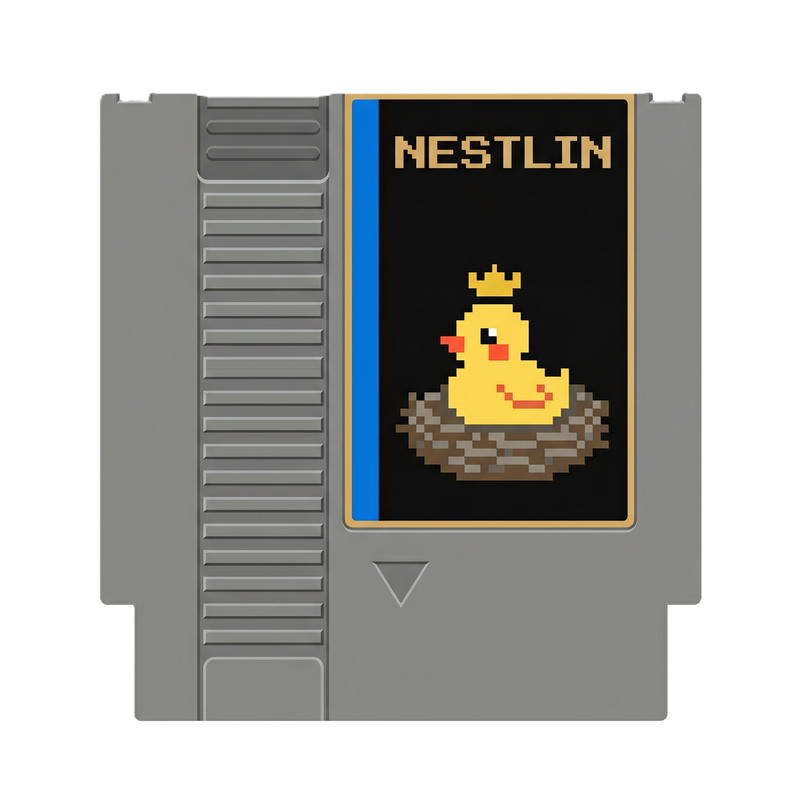

# Nestlin



A Nintendo Entertainment System emulator written in Kotlin. Personal learning project: full CPU, PPU, APU emulation, twelve mappers, NTSC + PAL timing, save states, battery-backed save RAM, and a Mesen2-driven state-diff regression suite.

> **What it is:** a from-scratch NES emulator — not a wrapper around libretro. Every cycle the PPU renders, the APU mixes, and the CPU executes is implemented in this codebase.
>
> **What it isn't:** production-grade. It's a hobby project; some peripherals and edge-case mapper behaviours remain unimplemented.

---

## Features

- **6502 CPU** — all 151 documented + unofficial opcodes, validated against `nestest.nes` (`GoldenLogTest`).
- **2C02 PPU** — background + sprite rendering, sprite-0 hit, 8×8 and 8×16 sprites, A12 edge exposed to mappers.
- **2A03 APU** — 5 channels (Pulse ×2, Triangle, Noise, DMC), frame counter, NTSC + PAL period tables, host-rate resampling.
- **12 mappers** — see *Supported mappers* below.
- **NTSC and PAL** — auto-detected from the iNES/NES 2.0 header and the NO-INTRO filename, with a manual `--region=` override.
- **Save states** (`.nstl`) and **battery-backed save RAM** (`.sav`, FCEUX/Mesen-compatible).
- **Input** — configurable keyboard and gamepad (via JInput); default keymap written to `~/.config/nestlin/input.json` on first run.
- **Display** — 1×/2×/3×/4× integer scale, Fit-to-window, fullscreen, nearest-neighbour pixel scaling.
- **Quality-of-life** — hold-Tab fast-forward, pause, speed-throttle toggle, screenshot capture, recent-ROMs menu.

---

## Supported mappers

| # | Name | Notes |
|---|------|-------|
| 0 | NROM | Donkey Kong, Super Mario Bros. |
| 1 | MMC1 / SxROM | Tetris, Zelda (PRG-RAM + battery). |
| 2 | CNROM / UNROM | Castlevania, Contra, Duck Hunt. |
| 3 | CNROM | Star Soldier, Paperboy. |
| 4 | MMC3 / TxROM | Mega Man 4-6, Kirby's Adventure (PRG-RAM + A12-IRQ + battery). |
| 5 | MMC5 | **Stub** — Castlevania III not yet playable. |
| 7 | AxROM | Marble Madness, Battletoads. |
| 9 | MMC2 / PxROM | Mike Tyson's Punch-Out!! (CHR latches). |
| 10 | MMC4 / FxROM | Fire Emblem Gaiden (CHR latches + PRG-RAM + battery). |
| 11 | Color Dreams | Bible Adventures. |
| 34 | BNROM / NINA-001 | Deadly Towers. |
| 69 | Sunsoft FME-7 | Batman: Return of the Joker, Gimmick! (CPU-cycle-clocked IRQ). |

For per-mapper game coverage, edge-case notes, and known issues, see **[`MAPPER_SUPPORT.md`](MAPPER_SUPPORT.md)**.

---

## Requirements

- **JDK 21** (the Gradle toolchain pin will download it automatically if missing)
- **Kotlin 1.9.22** (managed by Gradle)
- A display server (X11 / Windows / macOS) — required by JavaFX
- *(Optional, for cross-emulator regression tests)* **Mesen 2** at `MESEN2_PATH` (defaults to `tools/Mesen2/Mesen.exe`)

---

## Build & Run

```bash
# Build the runnable fat JAR
./gradlew build

# Run with a ROM
./gradlew run --args="path/to/rom.nes"
```

On Windows:

```bat
gradlew.bat build
gradlew.bat run --args="path/to/rom.nes"
```

Convenience wrapper that builds-then-runs: `./nestlin.sh path/to/rom.nes` (or `nestlin.bat` on Windows).

The runnable fat JAR is at `build/libs/nestlin-all.jar` (built by `shadowJar`; the Gradle `application` plugin also produces `./gradlew installDist` → `build/install/nestlin/bin/nestlin` if you prefer the wrapper-script form).

### Command-line flags

| Flag | Purpose |
|------|---------|
| `--debug` | Verbose CPU instruction logging to stdout. |
| `--region=pal\|ntsc` | Override the ROM's auto-detected region. |
| `--no-audio` | Disable audio output. |
| `--screenshot-interval N --screenshot-duration N` | Automated capture mode for validation harnesses. |

### Supported ROM formats

- `.nes` — iNES and NES 2.0 headers (NO-INTRO filenames are recognised for display + region).
- `.7z` — 7-Zip archives (single-ROM); transparent to the rest of the pipeline.

---

## Controls

### File menu

| Action | Description |
|--------|-------------|
| Load Game… | Open a `.nes` or `.7z`. |
| Load Recent | Quick access to recently played ROMs. |
| Hard Reset Game | Reload and power-cycle the current ROM. Preserves battery RAM. |
| Save State… | Snapshot to a chosen `.nstl` file. |
| Load State… | Restore from a `.nstl` file. |
| Exit | Flush battery RAM and quit. |

### Settings

| Action | Shortcut | Description |
|--------|----------|-------------|
| Speed Throttling (60 FPS) | Ctrl+T | Toggle wall-clock pacing. |
| Scale | — | 1× / 2× / 3× / 4× / Fit-to-window. |
| Fullscreen | F11 | Toggle fullscreen. |
| Pause | Ctrl+P | Pause/resume emulation. |

### Emulation

| Action | Shortcut | Description |
|--------|----------|-------------|
| Quick Save State | F5 | Save to `savestates/<rom>.quick.nstl`. |
| Quick Load State | F8 | Load the matching quick-save slot. |
| Fast-Forward | hold Tab | Disable throttling while held. |
| Screenshot | S | Save the current frame to `screenshots/`. |

### Default keyboard mapping (NES gamepad)

| NES | Keyboard |
|-----|----------|
| A | Z |
| B | X |
| Select | Space |
| Start | Enter |
| D-Pad | Arrow keys |

Edit `~/.config/nestlin/input.json` to remap. The default file is written automatically on first run.

### Gamepad

Any controller JInput recognises works out of the box (Xbox layout by default). Edit the `gamepad` section of `~/.config/nestlin/input.json` for other layouts.

---

## Testing

```bash
# Fast suite (CPU/PPU/APU/mapper unit tests; ~minutes)
./gradlew test

# Cross-emulator suite (boots Mesen2 as an oracle; needs MESEN2_PATH)
./gradlew testMesenComparison
```

The test strategy prefers **structured state diffs** (CPU regs, OAM, palette, mapper banks, CHR window) over pixel diffs. Pixels are a downstream, lossy view; a byte-equal state is a much stronger claim. Full reasoning lives in **[`docs/TESTING_STRATEGY.md`](docs/TESTING_STRATEGY.md)**.

The CPU has a single gold-standard regression: **`GoldenLogTest`** runs `nestest.nes` in automation mode and byte-compares the trace against `src/test/resources/nestest.log`. New CPU work that breaks this test isn't ready to merge.

---

## Project structure

| Path | What's there |
|------|--------------|
| `src/main/kotlin/.../cpu/` | 6502 core + 151 opcodes + addressing modes. |
| `src/main/kotlin/.../ppu/` | 2C02 rendering pipeline, OAM, palette, register decode. |
| `src/main/kotlin/.../apu/` | Channels, envelope, sweep, length counter, frame counter, resampler. |
| `src/main/kotlin/.../gamepak/` | iNES parsing + per-mapper implementations. |
| `src/main/kotlin/.../ui/` | JavaFX application, menus, scaling, fast-forward. |
| `src/main/kotlin/.../input/` | Keyboard + JInput gamepad, JSON config. |
| `src/test/kotlin/.../compare/` | Mesen2 oracle tests (state diff, not pixels). |
| `docs/` | Strategy + historical design notes. |
| `testroms/` | `nestest.nes` (the only ROM in git). |
| `tools/` | Local-only emulators (not in git; see `CLAUDE.local.md`). |

---

## Documentation

- **[`MAPPER_SUPPORT.md`](MAPPER_SUPPORT.md)** — which mappers are working, what games are known to play, and what each one's quirks are.
- **[`docs/TESTING_STRATEGY.md`](docs/TESTING_STRATEGY.md)** — the test pyramid and how to add a new regression test the right way.
- **[`docs/PPU_RENDERING_PLAN.md`](docs/PPU_RENDERING_PLAN.md)** — original design notes for background + sprite rendering.
- **[`docs/DONKEY_KONG_RENDERING_PLAN.md`](docs/DONKEY_KONG_RENDERING_PLAN.md)** — milestone-by-milestone walkthrough of bringing up rendering on a real game.
- **[`NES_REFERENCE_GUIDE_FINDINGS.md`](NES_REFERENCE_GUIDE_FINDINGS.md)** — distilled findings from the NESdev wiki and other reference material; the implementation's "why" notes.
- **[`dump_analyzer.py`](dump_analyzer.py)** — parse 64KB CPU memory dumps (`.dmp`) from debug sessions and query them by region, register, or address. Useful for post-mortem debugging.

---

## Contributing

This is a personal learning project, so the bar for "ready to merge" is mostly "the maintainer is happy with it." The minimum bar in practice:

1. **Build is green** (`./gradlew build`).
2. **Tests are green** (`./gradlew test`); add a failing test first for any bug you find.
3. **No new `assumeTrue`-skipped tests** (see `docs/TESTING_STRATEGY.md` §2.4 — silent skips false-green CI).
4. **Prefer state-diff regression tests over pixel-diff ones.**

For new mappers, see the "Adding New Mappers" section of `MAPPER_SUPPORT.md`.

---

## License

[MIT](LICENSE).
