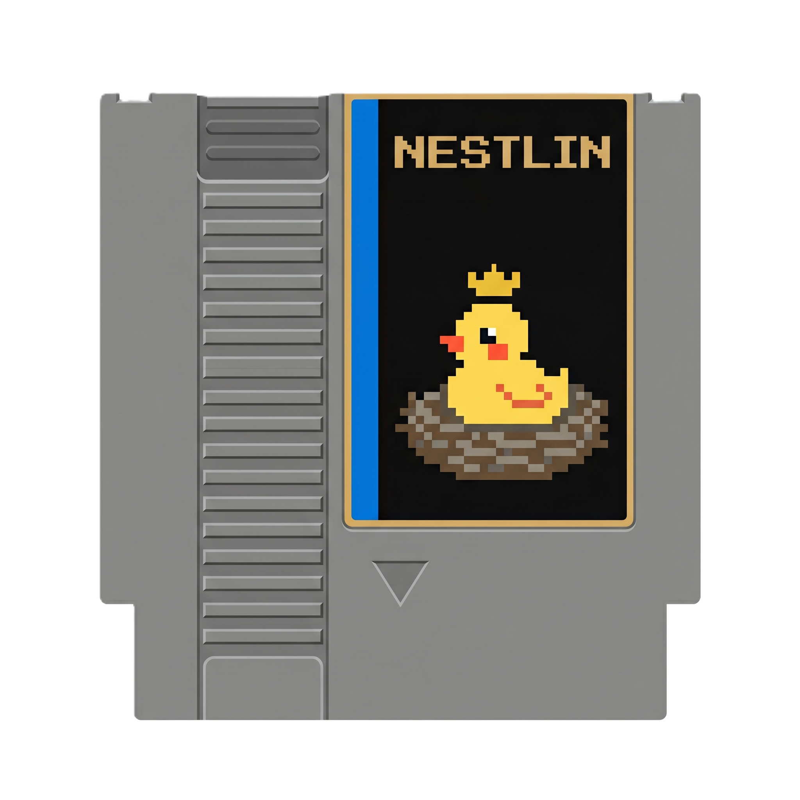

# Nestlin



A Nintendo Entertainment System emulator written in Kotlin. Personal learning project: full CPU, PPU, APU emulation, a broad set of routed mapper IDs, NTSC + PAL timing, save states, battery-backed save RAM, and a Mesen2-driven state-diff regression suite.

> **What it is:** a from-scratch NES emulator — not a wrapper around libretro. Every cycle the PPU renders, the APU mixes, and the CPU executes is implemented in this codebase.
>
> **What it isn't:** production-grade. It's a hobby project; some peripherals and edge-case mapper behaviours remain unimplemented.

---

## Features

- **6502 CPU** — all 151 documented + unofficial opcodes, validated against `nestest.nes` (`GoldenLogTest`).
- **2C02 PPU** — background + sprite rendering, sprite-0 hit, 8×8 and 8×16 sprites, A12 edge exposed to mappers.
- **2A03 APU** — 5 channels (Pulse ×2, Triangle, Noise, DMC), frame counter, NTSC + PAL period tables, host-rate resampling.
- **Mapper support** — see [`MAPPER_SUPPORT.md`](MAPPER_SUPPORT.md) for the current compatibility matrix. Mapper 5 is still a stub; the document groups the VRC2/VRC4 family entries where they share an implementation.
- **NTSC and PAL** — auto-detected from the iNES/NES 2.0 header and the NO-INTRO filename, with a manual `--region=` override.
- **Save states** (`.nstl`) and **battery-backed save RAM** (`.sav`, FCEUX/Mesen-compatible).
- **Input** — configurable keyboard and gamepad (via JInput); default keymap written to `~/.config/nestlin/input.json` on first run.
- **Display** — 1×/2×/3×/4× integer scale, Fit-to-window, fullscreen, nearest-neighbour pixel scaling.
- **Quality-of-life** — hold-Tab fast-forward, hold-Backspace rewind, pause, speed-throttle toggle, screenshot capture, recent-ROMs menu.
- **RetroAchievements** (optional, **softcore-only**) — sign in, ROM recognition, achievements window, unlock notifications, save-state progress sync. Native capability via vendored rcheevos v12.4.0 + a small C façade + JNA. Disabled in hardcore, leaderboards, unofficial achievement sets, and authoring. No-network default. See [`RA_INTEGRATION.md`](RA_INTEGRATION.md) for design and [`docs/MANUAL_RA_ACCEPTANCE.md`](docs/MANUAL_RA_ACCEPTANCE.md) for the per-OS manual acceptance script.

---

## Compatibility

Nestlin currently routes the mapper IDs listed in `MAPPER_SUPPORT.md` through `GamePak`, including shared VRC2/VRC4 implementations and mapper 5's explicit stub. A routed mapper is a code-coverage statement, not a promise that every game using that board is playable.

For per-mapper game coverage, test evidence, edge-case notes, and known issues, see **[`MAPPER_SUPPORT.md`](MAPPER_SUPPORT.md)**. Report a new game result with the [compatibility issue template](.github/ISSUE_TEMPLATE/compatibility_report.md); identify the dump by mapper, region, and checksum instead of uploading a ROM.

---

## Requirements

- **JDK 21** (the Gradle toolchain pin will download it automatically if missing)
- **Kotlin 1.9.22** (managed by Gradle)
- A display server (X11 / Windows / macOS) — required by JavaFX
- *(Optional, for cross-emulator regression tests)* **Mesen 2** at `MESEN2_PATH` (defaults to `tools/Mesen2/Mesen.exe`)

---

## Build & Run

```bash
# Build the runnable fat JAR
./gradlew build

# Run with a ROM
./gradlew run --args="path/to/rom.nes"
```

On Windows:

```bat
gradlew.bat build
gradlew.bat run --args="path/to/rom.nes"
```

Convenience wrapper that builds-then-runs: `./nestlin.sh path/to/rom.nes` (or `nestlin.bat` on Windows).

The runnable fat JAR is at `build/libs/nestlin-all.jar` (built by `shadowJar`; the Gradle `application` plugin also produces `./gradlew installDist` → `build/install/nestlin/bin/nestlin` if you prefer the wrapper-script form).

For command-line flags, supported ROM formats, first-run behavior, and platform-specific file locations, see the [user guide](docs/USER_GUIDE.md).

---

## Using Nestlin

The [user guide](docs/USER_GUIDE.md) is the source of truth for controls, keyboard/gamepad mapping, save states, battery RAM, screenshots, and RetroAchievements. The [troubleshooting guide](docs/TROUBLESHOOTING.md) covers common launch, input, audio, rendering, and compatibility failures.

---

## Testing

```bash
# Fast suite (CPU/PPU/APU/mapper unit tests; ~minutes)
./gradlew test

# Cross-emulator suite (boots Mesen2 as an oracle; needs MESEN2_PATH)
./gradlew testMesenComparison

# Documentation links/structure check
python tools/docs_lint.py
```

The cross-emulator smoke cases use ROMs that are not checked into Git. Set `NESTLIN_TESTROMS` to the directory containing `tetris.nes`, `lolo1.nes`, and `kirby.nes`; missing ROMs are reported as skipped tests.

The test strategy prefers **structured state diffs** (CPU regs, OAM, palette, mapper banks, CHR window) over pixel diffs. Pixels are a downstream, lossy view; a byte-equal state is a much stronger claim. Full reasoning lives in **[`docs/TESTING_STRATEGY.md`](docs/TESTING_STRATEGY.md)**.

The CPU has a single gold-standard regression: **`GoldenLogTest`** runs `nestest.nes` in automation mode and byte-compares the trace against `src/test/resources/nestest.log`. New CPU work that breaks this test isn't ready to merge.

---

## Project structure

The current package ownership and runtime flow are maintained in the [architecture guide](docs/ARCHITECTURE.md). Contributors should start with the [development guide](docs/DEVELOPMENT.md) rather than infer support or test policy from directory names.

---

## Documentation

The [documentation index](docs/README.md) is the starting point for users and contributors:

- **[`docs/USER_GUIDE.md`](docs/USER_GUIDE.md)** — installation, launch flags, controls, files, saves, and RetroAchievements.
- **[`docs/TROUBLESHOOTING.md`](docs/TROUBLESHOOTING.md)** — reproducible diagnostics and issue-reporting guidance.
- **[`docs/DEVELOPMENT.md`](docs/DEVELOPMENT.md)** — architecture, build/test lanes, mapper workflow, and documentation workflow.
- **[`docs/ARCHITECTURE.md`](docs/ARCHITECTURE.md)** — subsystem ownership and emulator state boundaries.
- **[`docs/TESTING_STRATEGY.md`](docs/TESTING_STRATEGY.md)** — the test pyramid and regression-test rules.
- **[`MAPPER_SUPPORT.md`](MAPPER_SUPPORT.md)** — current mapper/game support and known limits.
- **[`CONTRIBUTING.md`](CONTRIBUTING.md)** — issue, pull-request, legal, and review expectations.

Developer tools remain documented next to their source: [`tools/rom_info.py`](tools/rom_info.py) decodes headers and [`tools/dump_analyzer.py`](tools/dump_analyzer.py) inspects CPU memory dumps. The [documentation standards](docs/DOCUMENTATION_STANDARDS.md) and `python tools/docs_lint.py` check keep these links from going stale.

---

## Contributing

This is a personal learning project, so review capacity is limited. The minimum bar in practice:

1. **Build is green** (`./gradlew build`).
2. **Tests are green** (`./gradlew test`); add a failing test first for any bug you find.
3. **Documentation is current** and `python tools/docs_lint.py` passes.
4. **No new `assumeTrue`-skipped tests** (see `docs/TESTING_STRATEGY.md` §2.4 — silent skips false-green CI).
5. **Prefer state-diff regression tests over pixel-diff ones.**

See [`CONTRIBUTING.md`](CONTRIBUTING.md) for the full checklist, issue templates, security reporting, and agent/AI disclosure expectations.

For new mappers, see the "Adding New Mappers" section of `MAPPER_SUPPORT.md`.

---

## License

[MIT](LICENSE).
